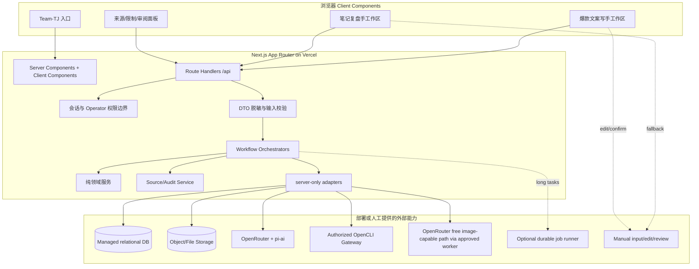
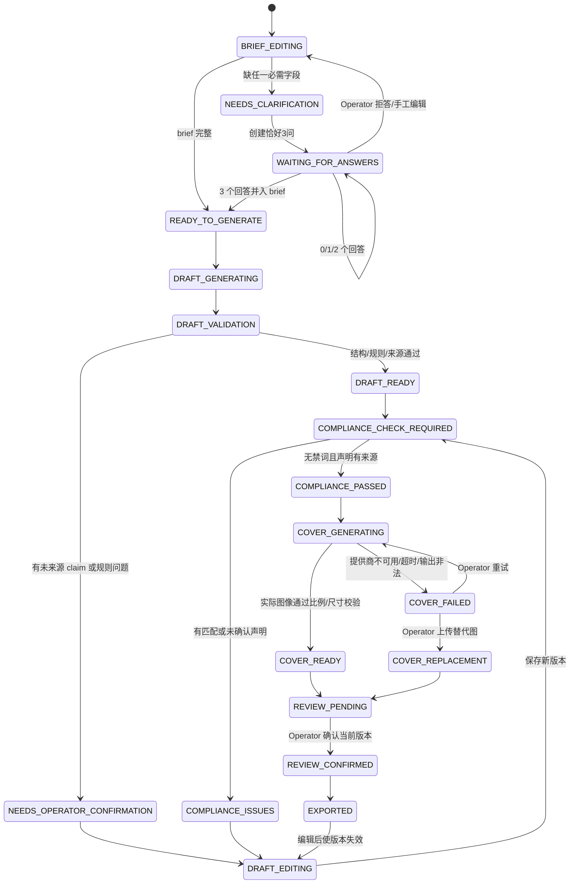
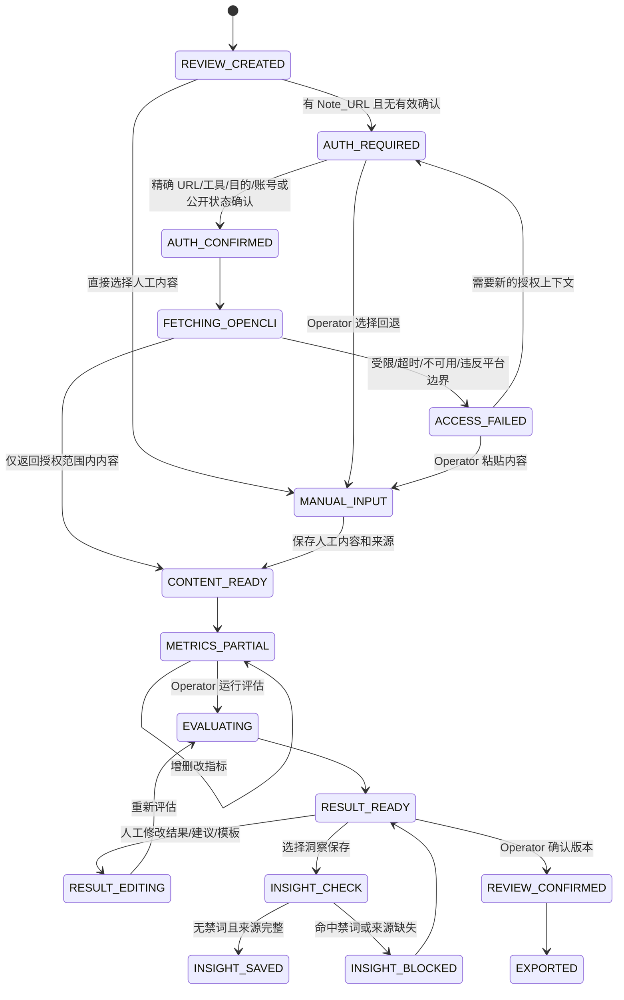

# Team-TJ 小红书 AI Agent 设计文档

> 功能：`team-tj-xiaohongshu-ai-agent`  
> 工作流：Requirements-First  
> 状态：设计阶段，待用户审阅  
> 范围：只定义可落地设计，不实现代码

## Overview

### 1.1 目标与范围

Team-TJ 小红书 AI Agent 是一个全栈 Next.js App Router 应用，部署目标为 Vercel，提供两个相互独立但可以共享洞察记忆的工作区：

1. **爆款文案写手（Copywriter）**：收集 Content_Brief、补充文件和禁词清单；在信息不足时严格询问恰好 3 个问题；根据本地《小红书爆款思路.txt》的 14 条规则生成结构化文案；执行禁词、事实声明和来源检查；生成实际的 3:4 封面图或进入明确的失败回退。
2. **小红书笔记文案复盘手（Review）**：接受网址与人工内容；仅在授权确认后经 opencli 获取允许访问的内容；对指标按 Operator 配置的阈值分层；输出指定复盘模板、低表现建议和绿色/黄色总体结论；将合规洞察保存到 Insight_Memory，供后续文案引用。

系统的核心原则是：

- **事实优先**：模型只能重组有 Source_Record 的事实，不能把缺失字段、指标或来源推测为事实。
- **人工最终控制**：文案、封面说明、指标、复盘结果和洞察都可人工编辑，并在保存、发布或导出前要求版本确认。
- **权限边界明确**：小红书访问只经过经授权的 OpenCLI_Access_Tool；不绕过登录、访问控制、付费墙、反爬或平台限制。
- **服务端保密**：pi-ai、OpenRouter、opencli 网关和部署服务所需凭据只在服务端环境中解析；客户端只接收最小化 DTO 和脱敏调用结果。
- **规则可验证**：模型负责候选生成，确定性校验器负责 14 条规则、5 个标题、字数、分点、标签、禁词、来源和指标阈值的最终判定。

### 1.2 非目标

本功能不负责：

- 自动登录、获取或保存小红书账号密码、Cookie、Token。
- 绕过平台访问控制、反爬、付费墙、地区限制或其他技术限制。
- 自动发布、点赞、评论、关注或批量操作小红书账号。
- 在未定义或不可验证时捏造完播率、阅读时长、曝光或互动指标。
- 承诺任何平台流量结果；“优秀/仍需改进”只表示对输入指标和阈值规则的机械评估。
- 用文字提示、占位框或仅有 Cover_Brief 冒充实际 Cover_Image。
- 把 Insight_Memory 当作当前业务事实的替代来源。

### 1.3 研究结论与设计依据

本设计使用了以下外部资料作为边界依据：

- [Next.js Route Handlers](https://nextjs.org/docs/app/getting-started/route-handlers)：App Router 下使用 `route.ts` 处理 Web Request/Response；非 GET 请求默认不缓存，因此写操作和生成任务必须显式控制幂等性与状态。
- [Vercel Environment and Security](https://vercel.com/academy/nextjs-foundations/env-and-security)：服务端数据访问层应由 `server-only` 保护；`NEXT_PUBLIC_` 变量会进入浏览器 bundle；应通过安全 DTO 向客户端传递最小数据。
- [pi-ai 官方 README](https://github.com/badlogic/pi-mono/blob/main/packages/ai/README.md)：pi-ai 提供统一模型接口、工具调用、流式事件、结构化上下文和 OpenRouter provider；因此将模型调用、工具调用与业务规则校验分层，而不是把校验写进 prompt。
- [OpenRouter 免费模型路由](https://openrouter.ai/docs/guides/routing/routers/free-router)：`openrouter/free` 会按请求能力动态筛选并选择免费模型，免费模型的可用性、延迟、限流和具体模型会变化；设计不绑定单一模型 ID，响应中记录实际模型标识。
- [OpenCLI 文档](https://github.com/jackwener/OpenCLI/blob/main/docs/index.md)：opencli 可复用已登录 Chrome 状态并提供浏览器/桌面自动化，但凭据留在浏览器环境；因此 Vercel 只调用受控的 OpenCLI 网关，无法访问时必须人工回退。

### 1.4 用户体验与视觉方向

入口和两个工作区采用同一套 Team-TJ 视觉语言：浅色背景、充足留白、单一主色加中性色、低噪声卡片、清晰的状态标签和精简 Logo。Logo 必须保留精确文本 `Team-TJ`，不使用复杂图形；建议采用文字 Logo + 极简几何短线标记，标记不承担语义，避免图像生成或模型输出错误品牌字样。

前端由 `ui-ux-pro-max` 负责设计智能输入，落地时应先检索“内容创作工作区 / 数据复盘仪表盘 / 安全授权确认 / 可编辑来源面板”四类模式，再固化到页面设计规范。此设计文档只固定信息架构、状态、可访问性和数据来源，不预先锁死具体颜色数值或第三方字体。

### 1.5 关键不变量摘要

- 每一个 Question_Set 永远恰好包含 3 个问题；未获得 3 个回答不能生成最终文案。
- 每个模型生成的可发布字段都必须能映射到一个或多个 Source_Record，无法映射的内容必须进入“需要 Operator 确认”。
- 每次禁词检查都记录清单 ID、版本、匹配文本、分块和次数；空清单也必须产生明确结果。
- 完播率只显示实际值和人工复盘标识，除非 Operator 自己定义阈值，否则系统不推导完播率等级。
- 任何调用日志、审计事件、错误和客户端 DTO 均不得包含 Credential 明文。
- 未完成 Access_Authorization_Confirmation 时，OpenCLI 网关调用次数必须为 0。
- 绿色总体结论只能由 7 个有值核心指标中的至少 4 个满足明确优秀条件产生；缺少全部核心指标时不输出颜色结论。

## Architecture

### 2.1 分层架构

### 2.2 组件边界

#### Client/UI 层

- 只负责表单、聊天消息、文件选择、草稿编辑、指标编辑、状态轮询和来源展示。
- 不导入 pi-ai、OpenRouter SDK、opencli adapter、数据库层或任何 `server-only` 模块。
- 不在浏览器中拼接或保存服务端 Credential；客户端请求只携带业务数据、会话 ID、版本号和用户确认动作。
- 对长任务采用 `202 Accepted + jobId` 和轮询/事件更新；页面刷新后可从服务端恢复状态。

#### Route Handler 层

- 负责 HTTP 方法、会话身份、请求大小、CSRF/Origin 检查、速率限制、JSON/FormData 解析和统一错误 DTO。
- 不直接实现业务规则；将请求交给对应 Orchestrator。
- 写操作使用 `expectedVersion` 或幂等键，避免重试造成重复版本、重复审计或重复外部调用。

#### Workflow Orchestrator 层

- `CopywriterOrchestrator`：Content_Brief → 字段诊断 → 恰好 3 问 → 文案生成 → 确定性校验 → 合规检查 → 封面生成/回退 → 审阅确认。
- `ReviewOrchestrator`：URL/人工输入 → 授权门禁 → OpenCLI/回退 → 内容归一化 → 指标录入 → 分层评估 → 建议/模板 → Insight 合规保存。
- `MemoryOrchestrator`：只接受通过禁词检查且有来源的 Review_Insight；为 Copywriter 生成引用 DTO。
- 每个编排器只协调步骤和状态迁移，不把持久化实现、模型 SDK 或 UI 格式混入领域逻辑。

#### Domain 层

确定性、可单元测试和属性测试的核心：

- Content_Brief 完整性诊断和问题生成策略。
- Copy_Draft 结构校验、字数/分点/标签/情绪/禁词/事实来源检查。
- Unicode 归一化后的禁词匹配。
- Metric_Threshold_Set 的区间、边界、缺失值和至少 4 项核心指标判定。
- Review_Result 分类、建议触发和 Markdown 模板渲染。
- Source_Record 关联完整性、版本冲突和审阅确认规则。

#### Adapter 层

- `PiAiModelAdapter`：使用 pi-ai 的统一模型/工具接口，限定 provider 为 OpenRouter；解析流式事件和结构化输出。
- `OpenRouterModelCatalogAdapter`：启动或定时刷新免费模型能力清单，校验实际模型标识、结构化输出、工具调用和图像能力。
- `OpenCliGatewayAdapter`：只接受已确认 URL 和授权上下文，调用已部署网关，不接收/返回账号凭据；响应必须归一化为 Accessible_Content 或受控失败。
- `CoverImageAdapter`：优先使用 OpenRouter 上实际可用的免费图像能力生成无文字视觉底图；由确定性 `CoverComposer` 叠加标题/安全区/右下角插画，输出真正的 PNG/JPEG 字节。若部署没有可用图像能力，明确进入失败回退，不伪造成功。
- `Repository`：数据库、对象存储、作业状态和审计记录的接口。Vercel 函数不依赖本地磁盘持久化。

### 2.3 任务与运行时模型

短请求（字段校验、禁词检查、阈值评估、读取会话）同步完成。模型生成、文件解析、封面生成和 OpenCLI 访问采用作业模型：

1. Route Handler 创建 `GenerationJob` 或 `ReviewFetchJob`，持久化输入版本和幂等键。
2. 返回 `202`、job ID 和可轮询状态，不返回密钥或原始第三方错误。
3. Worker/Background Function 调用编排器，周期性写入状态、脱敏进度和 Source_Record。
4. UI 轮询 `GET /api/jobs/:id`；页面关闭不影响作业。
5. 运行环境未提供持久作业执行器时，只允许低时延同步模式或人工回退；不得在 Vercel 函数结束后假设异步代码一定执行。

### 2.4 部署拓扑与环境假设

最小可部署拓扑为：Vercel 上的 Next.js + 托管关系数据库 + 对象存储 + OpenRouter 服务端访问。生产可用拓扑还需要：

- 可持续运行的任务执行器/队列，用于模型长响应、文件解析、封面生成和 OpenCLI 请求。
- 一个与 Vercel 网络可达的 OpenCLI Gateway；网关所在环境拥有 Operator 明确授权的 Chrome 会话或由 Operator 直接运行并转发结构化结果。
- 图像生成能力必须是 OpenRouter 上当前可用、标记为免费且具备图像输出的路径；如需 worker，该 worker 只能代理这条 OpenRouter 免费路径，不得改用其他模型或收费服务。若不能满足，Cover_Image 功能只能提供 Cover_Brief、重新生成和人工上传替代。
- 身份认证与 Operator 访问控制。需求要求最终人工确认，但没有指定身份提供商；部署方必须提供至少一个受信会话机制。
- 生产日志、监控和密钥轮换配置。日志只记录脱敏状态、provider/model/tool ID、job ID 和 Source_Record ID。

## Components and Interfaces

### 3.1 页面与 App Router 路由

| 页面路由 | 用途 | 主要状态 |
|---|---|---|
| `/` | Team-TJ 入口、Logo、两个工作区卡片 | `idle` |
| `/copywriter` | 爆款文案写手聊天工作区 | brief、questions、draft、compliance、cover、review |
| `/reviewer` | 小红书笔记文案复盘手 | URL、授权、访问、指标、结果、洞察 |
| `/insights` | 已保存 Insight_Memory、来源与合规状态 | list、引用、归档 |
| `/settings/rules` | 禁词清单、阈值集合、OpenCLI 状态和限制说明 | versioned settings |
| `/jobs/[jobId]` | 长任务状态和失败回退 | queued/running/succeeded/failed |

### 3.2 服务端接口

所有响应均为脱敏 JSON DTO；写操作携带 `expectedVersion` 和幂等键。具体字段名可在实现阶段映射到代码约定，但语义不可删减。

#### 通用

| Method | Endpoint | 行为 |
|---|---|---|
| `GET` | `/api/session` | 返回当前 Operator 的最小身份和权限，不返回 Credential。 |
| `GET` | `/api/jobs/:jobId` | 返回作业状态、阶段、可显示错误、脱敏 Source_Record 摘要。 |
| `GET` | `/api/source-records/:id` | 返回来源类型、引用范围、版本、时间和限制；敏感原文按权限和最小化策略返回。 |

#### Copywriter

| Method | Endpoint | 行为 |
|---|---|---|
| `POST` | `/api/copywriter/sessions` | 创建 Copywriter_Workspace 会话和空版本。 |
| `GET/PATCH` | `/api/copywriter/sessions/:id` | 读取/更新 Content_Brief、Blocked_Term_List、引用洞察；PATCH 要求版本匹配并生成审计。 |
| `POST` | `/api/copywriter/sessions/:id/files` | 上传 Supplementary_File；返回文件名、解析状态、Source_Record ID，不回显私密配置。 |
| `POST` | `/api/copywriter/sessions/:id/questions` | 提交恰好 3 个问题的回答；验证问题集 ID、回答数和版本。 |
| `POST` | `/api/copywriter/sessions/:id/draft/generate` | 诊断 brief；缺字段返回 `clarification_required` 和恰好 3 问，否则创建生成作业。 |
| `GET/PATCH` | `/api/copywriter/sessions/:id/draft` | 获取/人工编辑 Copy_Draft；编辑保存 before/after、reason、editor 和版本。 |
| `POST` | `/api/copywriter/sessions/:id/compliance/check` | 对全部指定分块执行禁词、事实来源和声明检查。 |
| `POST` | `/api/copywriter/sessions/:id/cover/generate` | 仅允许存在合规结果的版本创建 Cover_Image 作业。 |
| `POST` | `/api/copywriter/sessions/:id/cover/upload` | 上传人工替代封面；校验 3:4 或记录需要裁切/人工确认的状态。 |
| `PATCH` | `/api/copywriter/sessions/:id/cover` | 编辑 Cover_Brief、封面标题、来源或替换状态；重新合成/重新检查。 |
| `POST` | `/api/copywriter/sessions/:id/confirm` | 确认当前 Copy_Draft、Cover_Brief、Cover_Image 和合规版本，可保存/导出。 |

#### Reviewer

| Method | Endpoint | 行为 |
|---|---|---|
| `POST` | `/api/reviews` | 创建 Review_Workspace 复盘会话，保存 Note_URL 原始值和规范化值。 |
| `PATCH` | `/api/reviews/:id/authorization` | 创建/更新 Access_Authorization_Confirmation，必须绑定精确 URL、工具标识、目的、账号/公开状态和时间。 |
| `POST` | `/api/reviews/:id/fetch` | 授权门禁通过后创建 OpenCLI 访问作业；否则只返回人工回退提示，不调用网关。 |
| `POST` | `/api/reviews/:id/manual-content` | 保存人工粘贴的标题、正文、封面描述和手工指标来源。 |
| `GET/PATCH` | `/api/reviews/:id/metrics` | 录入、编辑、删除八类指标和来源；每次变更生成版本。 |
| `GET/PATCH` | `/api/reviews/:id/thresholds` | 读取/编辑 Metric_Threshold_Set；默认规则版本化，完播率不自动增加阈值。 |
| `POST` | `/api/reviews/:id/evaluate` | 执行指标分层、总体颜色、数据缺口、模板和建议。 |
| `GET/PATCH` | `/api/reviews/:id/result` | 读取/人工编辑 Review_Result；编辑后必须重新评估或标记人工覆盖。 |
| `POST` | `/api/reviews/:id/insights/check` | 对选中的 Review_Insight 执行禁词和来源检查。 |
| `POST` | `/api/reviews/:id/insights` | 仅保存通过检查的洞察到 Insight_Memory。 |
| `POST` | `/api/reviews/:id/confirm` | 确认复盘结果、模板、洞察或导出版本。 |

#### Settings/规则

| Method | Endpoint | 行为 |
|---|---|---|
| `GET/POST/PATCH/DELETE` | `/api/settings/blocked-terms` | 禁词清单的创建、编辑、删除、导入和版本化。 |
| `GET/POST/PATCH` | `/api/settings/threshold-sets` | 指标阈值集和边界策略的版本化维护。 |
| `GET` | `/api/settings/integrations/status` | 返回模型、OpenCLI、图片能力是否可用及脱敏原因；不返回连接串、Token 或系统路径。 |

### 3.3 关键接口契约

#### Copywriter 输入与输出

`CopywriterInput` 必须包含：

- `briefVersion`、主题、目标人群、核心结果、具体痛点、可复制方法、可验证数字/参数、真实缺点、结尾行动。
- 一个或多个 Blocked_Term_List 版本引用。
- Supplementary_File 引用和解析状态。
- 可选 Insight_Memory 引用列表。

`CopyDraft` 必须包含固定区块：

`targetAudience`、`targetEmotion`、`titles[5]`、`opening`、`firstThreeLines`、`painPoint`、`method`、`realLimitation`、`body`、`bodyPoints[3]`、`interactionEnding`、`tags[8]`（3 大词/3 中词/2 精准长尾）、`ruleCheck`、`complianceStatus`、`sourceRecordIds`、`needsOperatorConfirmation`。

模型输出先进入结构化 schema，再由确定性校验器接受/拒绝；模型不能直接改变状态为 `confirmed`。

#### Review 输入与输出

`ReviewInput` 必须包含：

- 规范化 Note_URL 或 Manual_Content_Input。
- 若要访问 URL，必须先有与精确 URL 绑定的 Access_Authorization_Confirmation。
- 八类指标的可选值、单位、来源、录入时间和版本。
- Metric_Threshold_Set 版本。

`ReviewResult` 必须包含：

- 内容摘要、可观察结论、需要人工确认、无法评估。
- 每个指标的原始值、单位、来源、分层、边界标识和触发规则。
- 曝光、CTR、阅读时长、点赞、收藏、评论、涨粉的总体达标计数；完播率只显示人工复盘状态。
- 绿色 `笔记文案优秀` 或黄色 `笔记文案仍需改进`，或在七项核心指标全缺失时显示 `需要人工输入核心优秀指标` 且无颜色结论。
- 低表现建议、指定 Markdown 模板、Source_Record 列表和人工编辑审计。

### 3.4 Agent 工具边界

pi-ai Agent 只暴露经过 allowlist 的工具：

- `read_source_rules`：读取已固定版本的本地规则快照，不允许模型写规则。
- `read_brief_sources`：读取当前 Content_Brief、文件解析结果和已批准 Insight 摘要。
- `propose_copy_draft`：返回结构化候选，不执行发布。
- `classify_review_text`：只对已获取/人工提供内容做摘要和原因候选。
- `propose_recommendations`：根据领域评估结果生成建议候选，必须带 Source_Record 引用。
- `compose_cover_visual`：只生成无文字视觉底图或请求图像能力；标题和 Logo 不由模型直接绘制。

禁止 Agent 工具：任意网页抓取、任意 shell、任意文件系统写入、任意账号操作、任意发布、任意绕过授权、读取环境变量、读取 Credential、修改阈值或直接保存洞察。

## Data Models

以下模型使用关系数据库保存结构化元数据，原始上传文件和实际 Cover_Image 保存到对象存储；所有表包含 `id`、`createdAt`、`updatedAt`、`version`、`createdBy` 等基础字段。模型字段为逻辑契约，不是实现代码。

### 4.1 工作流与版本

#### `WorkflowSession`

- `id`, `operatorId`, `kind: COPYWRITER | REVIEWER`, `status`, `currentVersion`, `createdAt`, `updatedAt`。
- `status` 必须来自对应状态机；不允许由客户端任意赋值。

#### `ContentBriefVersion`

- `sessionId`, `version`, `fields`: 主题、目标人群、核心结果、痛点、方法、参数/数字、真实缺点、结尾行动。
- `sourceRecordIds`, `supplementaryFileIds`, `insightMemoryIds`, `operatorProvidedFields`。
- `missingFields`, `contentHash`, `editedBy`, `editReason`。

#### `QuestionSet`

- `id`, `sessionId`, `briefVersion`, `questions[3]`, `answers[3]`（未回答时为空）、`status: OPEN | ANSWERED | DECLINED`。
- 不变量：`questions.length === 3`；`ANSWERED` 仅在 3 个回答均存在时成立；问题不得要求模型猜测事实。

#### `CopyDraftVersion`

- `sessionId`, `version`, `targetAudience`, `targetEmotion`。
- `titles[5]`, `opening`, `firstThreeLines`, `painPoint`, `method`, `realLimitation`, `body`, `bodyPoints[3]`, `interactionEnding`, `tags[8]`。
- `tagBuckets: { broad[3], medium[3], longTail[2] }`、`appliedRuleIds[14]`、`sourceRecordIds`。
- `validationStatus`, `complianceStatus`, `needsOperatorConfirmation`, `modelMetadata`（provider/model ID、request ID、耗时，不含凭据）。

### 4.2 文件、封面与合规

#### `SupplementaryFile`

- `id`, `sessionId`, `objectKey`, `originalFilename`, `mimeType`, `sizeBytes`, `sha256`、解析状态、解析错误码、`sourceRecordId`。
- 文件解析失败时保留 Content_Brief 版本；禁止把失败文件内容当作已读取事实。

#### `BlockedTermListVersion`

- `id`, `name`, `version`, `terms[]`, `normalizationPolicy`, `status`、导入来源、创建/编辑信息。
- 清单可为空；空清单检查结果仍必须记录 `NOT_CONFIGURED`。

#### `ComplianceResult`

- `id`, `targetType`, `targetVersion`, `checkedBlocks[]`。
- 每个匹配包含 `term`, `normalizedTerm`, `block`, `occurrenceCount`, `sourceListId`, `sourceListVersion`, `span`（如可计算）。
- 事实声明检查包含 `claim`, `sourceRecordIds`, `status: VERIFIED | NEEDS_OPERATOR_CONFIRMATION | REMOVED`。

#### `CoverBrief`

- `sessionId`, `draftVersion`, `title`（≤9 个汉字）、视觉风格、留白要求、真实缺点/注意事项、右下角插画说明、`sourceRecordIds`。

#### `CoverAsset`

- `id`, `sessionId`, `coverBriefVersion`, `objectKey`, `mimeType`, `width`, `height`, `aspectRatio`、像素 hash、生成状态、生成时间、生成/上传来源、编辑版本、`sourceRecordIds`。
- 成功状态要求 `width / height = 3 / 4`（允许实现定义的像素级整数公差，但默认要求精确 3:4），并记录实际尺寸。
- 失败状态必须保存失败分类、可显示原因、Cover_Brief 和重试/上传入口。

### 4.3 访问授权与复盘

#### `AccessAuthorizationConfirmation`

- `id`, `reviewId`, `exactNoteUrl`, `normalizedNoteUrl`, `toolId`, `purpose`, `accountMode: AUTHORIZED_ACCOUNT | PUBLIC_ACCESS`, `confirmedAt`, `operatorId`, `expiresAt`（可选）、`confirmationVersion`。
- URL、工具和目的必须与后续 OpenCLI 调用的审计记录一致；URL 变更必须重新确认。

#### `AccessibleContent`

- `reviewId`, `authorizationId`, `retrievedAt`, `contentType`, `title`, `body`, `coverReference`, `observedMetrics`, `rawHash`, `sourceRecordId`、平台限制说明。
- 只保存网关允许返回的内容；不保存账号 Cookie/Token。

#### `ManualContentInput`

- `reviewId`, `title`, `body`, `coverDescription`, `metricValues`, `enteredBy`, `enteredAt`, `editVersion`, `sourceRecordId`。
- 每个人工指标都带 `origin: OPERATOR_MANUAL`，不能被模型或 URL 推断覆盖。

#### `MetricThresholdSet`

- `id`, `version`, `operatorId`, `exposure`, `ctr`, `readSeconds`, `completionRate: UNDEFINED_UNLESS_OPERATOR_DEFINED`, `likeRate`, `saveRate`, `commentRate`, `followers`。
- 每个规则包含单位、比较符、优秀/低表现区间和边界策略。默认版本按需求中的严格 `>`、`>=/<` 和边界人工确认规则初始化；Operator 修改后产生新版本。
- 领域层使用整数曝光/涨粉、秒数和 basis points 表示比率，避免浮点边界误判；UI 可显示百分比。

#### `MetricValue`

- `metricType`, `value`, `unit`, `origin: OPENCLI | MANUAL | OBSERVED_CONTENT`, `sourceRecordId`, `enteredAt`, `version`。
- 缺失值与零值必须区分；负数、无穷、非法百分比和单位不一致均拒绝。

#### `ReviewResultVersion`

- `reviewId`, `version`, `contentSummary`, `metricAssessments[]`, `coreExcellentCount`, `colorConclusion`, `observableConclusions`, `needsHumanConfirmation`, `notEvaluable`, `reasons[]`, `recommendations[]`, `markdownTemplate`, `sourceRecordIds`。
- `recommendations[]` 每项包含低表现指标、实际值、触发规则、关联内容锚点和 Source_Record。

### 4.4 洞察、来源与审计

#### `ReviewInsight`

- `reviewId`, `selectedText`, `insightType`, `normalizedInsight`, `sourceRecordIds`, `metricThresholdSetVersion`, `complianceResultId`, `status: CANDIDATE | APPROVED | BLOCKED`。

#### `InsightMemory`

- `id`, `insightId`, `text`, `sourceNoteUrlOrManualInput`, `savedAt`, `metricThresholdSetVersion`, `sourceRecordIds`, `complianceResultId`, `status`、可归档标记。
- 只有 `ComplianceResult` 无匹配且来源完整的洞察才能进入 `APPROVED`。

#### `SourceRecord`

- `id`, `sourceType: SOURCE_RULES | BRIEF_FIELD | FILE | URL | AUTHORIZATION | OPENCLI_CONTENT | MANUAL_INPUT | METRIC | THRESHOLD_SET | INSIGHT | MODEL_OUTPUT | HUMAN_EDIT`。
- `sourceRef`, `version`, `contentHash`, `capturedAt`, `operatorId`, `parentSourceRecordIds`, `accessLimitations`, `redactionStatus`。
- 每个 AI 输出字段、结论、建议和导出版本必须可回溯到至少一个 Source_Record；模型自身不是业务事实来源。

#### `AuditEvent`

- `id`, `actorType: OPERATOR | SYSTEM | MODEL | OPENCLI`, `actorId`, `action`, `entityType`, `entityId`, `beforeHash`, `afterHash`, `reason`, `resultStatus`, `sourceRecordId`, `providerId/modelId/toolId`、时间和 trace ID。
- 禁止字段：任意 Credential、Cookie、Authorization header、完整内部异常堆栈和未脱敏第三方响应。

### 4.5 关系与删除策略

- `WorkflowSession 1:N Version`；所有当前状态都指向一个不可变版本。
- `CopyDraftVersion N:M SourceRecord`；`ReviewResultVersion N:M SourceRecord`；`InsightMemory N:M SourceRecord`。
- 删除采用软删除/归档，来源和审计不可静默删除；对象存储使用生命周期策略清理孤立文件，并保留审计所需 hash。
- 导出前运行 DTO 脱敏和事实来源校验；导出只包含 Operator 选择的业务内容、来源摘要和限制，不包含内部路径、密钥、网关连接信息或完整错误堆栈。

## 5. State Machines

### 5.1 Copywriter 状态机

迁移规则：

- `DRAFT_GENERATING` 必须引用一个完整、不可变的 ContentBriefVersion 和 QuestionSet（若存在）。
- 输入 brief、文件、禁词清单或洞察版本发生变化时，旧 Draft 不删除，但迁移到 `NEEDS_OPERATOR_CONFIRMATION`/`COMPLIANCE_CHECK_REQUIRED`，不可直接导出。
- `COVER_GENERATING` 只能从 `COMPLIANCE_PASSED` 进入；Cover 失败不回滚文案和 Cover_Brief。
- 任意人工编辑创建新版本，旧版本只读；人工确认针对具体版本，不能复用到后续版本。

### 5.2 Review 状态机

关键门禁：

- `AUTH_CONFIRMED` 是 OpenCLI 调用的唯一入口；URL、工具、目的、账号/公开访问状态任何一项变化都回到 `AUTH_REQUIRED`。
- `ACCESS_FAILED` 记录失败 Source_Record，但不自动重试无限次、不自动切换到其他抓取路径。
- `METRICS_PARTIAL` 可生成“数据缺口”视图；只有 Operator 主动执行评估才创建 Review_ResultVersion。
- 完播率没有 Operator 定义的阈值时只能是 `OBSERVED/MANUAL_REVIEW`，不能触发系统低表现建议。

### 5.3 Job 状态机

所有长任务通用：`QUEUED → RUNNING → SUCCEEDED`，或 `QUEUED/RUNNING → RETRYABLE_FAILURE → QUEUED`，或 `RUNNING → TERMINAL_FAILURE`。每次状态迁移记录尝试次数、脱敏错误码、输入版本和 Source_Record；超过部署方配置的最大重试次数后必须显示人工回退，而不是继续调用外部服务。

## 6. Validation and Security Strategy

### 6.1 输入与结构验证

所有边界均在服务端执行，客户端校验只用于即时反馈：

1. **请求层**：校验 Content-Type、body 大小、FormData 文件大小/MIME、URL 语法、分页/数组上限、版本号和幂等键。
2. **身份层**：从可信会话读取 Operator，不接受客户端传入的 operatorId 作为授权依据。
3. **领域 schema**：使用 TypeScript schema validator（具体库在实现阶段固定）验证 DTO；未知字段默认拒绝，避免模型/客户端注入未定义状态。
4. **文本层**：统一 Unicode NFC、大小写、空白和全半角策略；汉字数、Emoji 数、句子和段落边界均由同一 tokenizer 实现，避免 UI 与服务端计数不一致。
5. **来源层**：每个外部事实、指标、声明、建议和导出字段执行 source closure 检查；缺来源即阻断或标记确认。
6. **模型层**：pi-ai 返回的结构化输出先做 schema 校验，再做确定性 14 条规则校验；失败时最多进行一次“按错误列表修复”的重试，修复失败则进入人工编辑，不循环调用。
7. **并发层**：更新使用乐观锁 `expectedVersion`；版本冲突返回当前版本摘要并要求 Operator 重新加载，禁止静默覆盖。

### 6.2 Copy_Draft 确定性校验器

校验顺序固定为：

1. `targetAudience` 单值和 brief 一致。
2. 固定区块存在；标题 5 个、正文分点 3 个、标签 8 个。
3. 标题汉字数≤20；封面标题汉字数≤9；正文汉字数≤300。
4. 目标情绪集合大小为 1；标题/首句至少含该情绪或结构证据。
5. 14 条规则逐条产生 `PASS/FAIL/NEEDS_OPERATOR_CONFIRMATION`，并引用 Source_Rules 快照 hash。
6. 全部需检查分块执行固定禁词和所有用户清单匹配。
7. 数据/背书/案例/效果 claim 映射到 Content_Brief、Supplementary_File 或已批准 Insight_Memory；不能映射者不进入可确认前的发布 DTO。
8. 生成 `Compliance_Result` 和 `needsOperatorConfirmation`；校验器不自行发布或保存洞察。

### 6.3 指标规范与分层规则

域模型中的比率使用 basis points（例如 15% = 1500 bps），UI 再格式化为百分比。所有指标都区分 `missing`、`zero` 和 `value`。默认规则如下；Operator 可复制为新版本修改，但每次结果必须显示实际使用的版本。

| 指标 | 优秀/高表现 | 中间层 | 低表现 | 等值边界 |
|---|---|---|---|---|
| 曝光 | `>5000`：流量优秀且无任何违规 | `2000< x <5000`：中等且无违规、内容质量不佳；`500< x <2000`：低且质量严重不佳/可能违规；`100< x <500`：检查账号异常或严重违规 | `<100`：隐藏笔记并进行养号操作 | `100/500/2000/5000`：阈值边界，人工确认，不归类 |
| CTR | `>15%`：封面优秀 | `9%≤x<15%`：封面改进 | `<9%`：加强封面 | `15%`：边界人工确认 |
| 阅读时长 | `>20s`：内容优质 | `10s≤x<20s`：内容一般 | `<10s`：吸引点很少 | `20s`：边界人工确认 |
| 点赞率 | `>15%`：点赞优秀 | `10%≤x<15%`：点赞一般；`5%≤x<10%`：点赞少吸引点 | `<5%`：点赞极少吸引点 | `15%`：边界人工确认 |
| 收藏率 | `>13%`：收藏优秀 | `3%≤x<13%`：收藏一般 | `<3%`：不值得收藏 | `13%`：边界人工确认 |
| 评论率 | `>5%`：评论优秀 | `1%≤x<5%`：评论一般 | `<1%`：无评论吸引 | `5%`：边界人工确认 |
| 涨粉数 | `>30`：涨粉优秀 | `≤30`：涨粉一般 | — | 无额外等值边界 |
| 完播率 | 不设置系统默认阈值 | 显示实际值、来源、供人工复盘 | 仅当 Operator 自己定义并标记低表现时触发建议 | 无系统边界 |

总体颜色只统计 7 项：曝光、CTR、阅读时长、点赞率、收藏率、评论率、涨粉数。对有值且满足对应优秀条件的项计数：

- `count ≥ 4`：绿色“笔记文案优秀”。
- `0 < count < 4`：黄色“笔记文案仍需改进”。
- 所有 7 项缺失：显示“需要人工输入核心优秀指标”，`colorConclusion = null`。
- 任意一个指标缺失不被当作失败，也不被模型推断；它只减少可计数项，并在数据缺口中显示。
- 边界值先标记人工确认；未确认的边界值不得计为优秀。

### 6.4 URL、OpenCLI 和 SSRF 安全

- 只接受实现阶段明确的官方小红书 URL allowlist；拒绝任意协议、内网地址、重定向到非 allowlist 域名、包含凭据的 URL 和非必要 query。
- OpenCLI Gateway 接口只接受 `reviewId + authorizationId + exactNoteUrl`，服务端从数据库加载授权，不信任客户端自己上传的授权对象。
- 网关响应限制内容大小、字段范围和执行时间；失败分类为 `AUTH_REQUIRED`、`NOT_PUBLIC`、`PLATFORM_BLOCKED`、`TOOL_UNAVAILABLE`、`TIMEOUT`，不返回 Cookie、Token 或完整浏览器错误。
- UI 只显示“当前授权是否足够”和可执行的下一步；没有“绕过”“强制抓取”“使用未授权账号”等按钮或 Agent 工具。

### 6.5 凭据安全

- 所有模型、OpenCLI、对象存储、数据库和部署服务 Credential 只由服务端环境变量/平台密钥存储提供；不使用客户端可读前缀，不进入 DTO、数据库业务字段、对象元数据或 URL。
- `server-only` 数据访问层隔离 credential reader、pi-ai adapter、OpenCLI adapter 和存储 adapter；Client Component 不能导入。
- 日志采用字段白名单，而不是对任意异常对象 `JSON.stringify`；错误统一映射为公开错误码。
- 请求/响应、模型消息、导出 Markdown 和 Source_Record 摘要经过递归脱敏，匹配 key 名和 secret-like value；脱敏后仍保留调用状态和追踪 ID。
- 生产环境启用短生命周期、轮换和最小权限；OpenCLI 网关使用单独服务凭据，不能复用模型密钥。

### 6.6 封面图生成与失败回退

封面生成分两步：

1. `CoverImageAdapter` 请求当前 OpenRouter 免费且实际具备图像输出能力的路径生成**无文字**视觉底图，输入包含主题、素人感、留白、右下角插画、真实缺点和禁止塑料感等约束。
2. `CoverComposer` 在服务端将≤9字手写感粗体标题、Logo 和安全区域叠加到图像上，导出真实 PNG/JPEG；随后重新读取像素尺寸和 hash，校验精确 3:4。

如果免费模型路由当前不支持图像输出、调用超时、返回非图像或无法达到 3:4：

- 任务为 `COVER_FAILED`，保存脱敏失败分类和 Source_Record。
- 保留 Cover_Brief、标题编辑入口、重试和人工上传入口。
- 不显示“已生成”占位图，不将 Cover_Brief 计为 Cover_Image。
- 人工上传的替代图仍需记录尺寸、来源、编辑人和替换原因；若不是 3:4，不静默裁切，显示人工确认/裁切选项。

## Correctness Properties

属性测试适用于本功能中可分离的纯领域逻辑：文本结构验证、来源闭包、字符串匹配、状态门禁、指标分层、模板映射和脱敏。UI 像素表现、真实 OpenCLI、数据库、Vercel 部署和图像提供商仍使用示例、集成、视觉回归和冒烟测试。

### 7.1 属性反思与合并结果

预分析初步识别了大量可测试标准。反思后合并了互相蕴含的重复项：

- 将标题数量/长度、正文/分点/标签配额合并为一个 Draft 结构属性，避免为同一 validator 写重复随机测试。
- 将 8.5–8.10 的曝光区间和边界、8.11–8.14 的 CTR 分层等分别归入统一的“分层穷尽性/互斥性”属性，边界样例仍保留。
- 将 8.34 与 8.35 合并为一个 `count ≥ 4 ↔ green` 的双向属性，8.36 作为空集合特例。
- 将所有“建议必须有内容锚点/来源”的标准合并为建议来源闭包属性。
- UI 样式、页面区块、真实图像视觉感受、第三方接线不写成 PBT 属性，改由组件、视觉、集成和人工审阅覆盖。

### Property 1: Brief 完整性与事实不猜测

**For all** Content_Brief 字段组合，只有包含主题、目标人群、核心结果、具体痛点、可复制方法、可验证数据或参数、真实缺点和结尾行动的版本才能进入 `READY_TO_GENERATE`；任一缺失组合必须进入澄清或人工编辑状态，且生成内容不得新增没有 Source_Record 的业务事实。

**Validates: Requirements 2.2, 2.5, 3.4, 3.5, 5.7, 5.8**

### Property 2: 澄清问题恰好三问

**For all** 非空缺失字段集合，系统生成的 Question_Set 都恰好包含 3 个问题；在回答数小于 3 时状态保持等待补充且不生成最终 Copy_Draft，在收到 3 个回答后每个回答都以 Operator 来源并入新 brief 版本。

**Validates: Requirements 3.1, 3.2, 3.3**

### Property 3: 输入版本变更使下游版本失效

**For all** 已有 Copy_Draft 和任一 brief、文件、禁词清单或引用洞察的版本变更，旧 Draft 保持不可变，新版本必须标记需要重新检查并拥有前后 Source_Record 和审计记录。

**Validates: Requirements 2.6, 12.6**

### Property 4: Copy_Draft 固定结构和配额

**For all** 被 validator 接受的 Copy_Draft，标题数量为 5 且每个汉字数≤20，正文汉字数≤300，正文分点数量为 3，标签总数为 8 且 bucket 配额为 3/3/2，正文 Emoji 数为 4–6，结尾包含行动且不含禁止行动词。

**Validates: Requirements 4.3, 4.14, 4.15, 4.16, 4.17, 4.18, 4.21**

### Property 5: 标题钩子与情绪唯一性

**For all** 被接受的标题集合，单个标题都包含数字或情绪钩子以及信息缺口/反差证据，排除固定禁词和全部已配置禁词；整个草稿的目标情绪集合大小恰为 1，且该情绪在标题或首句有证据。

**Validates: Requirements 4.4, 4.5, 4.8**

### Property 6: 14 条规则的结构化映射

**For all** 合法 Content_Brief 和内容类型，Copy_Draft 的首句、前三行、痛点、方法、参数、真实缺点、反差、内容结构、已知实体和结尾都能映射到对应的 Source_Rules/brief 字段；方法保留输入工具、步骤、参数、口令和模型来源，不用模糊量词替代具体数字。

**Validates: Requirements 4.1, 4.2, 4.6, 4.7, 4.9, 4.10, 4.11, 4.12, 4.13, 4.19, 4.20**

### Property 7: 禁词检查穷尽且来源完整

**For all** Copy_Draft 分块和一个或多个 Blocked_Term_List，检查器都遍历 5 个标题、首句、正文、正文分点、标签和结尾；每个匹配的词、分块、归一化次数、清单 ID 和版本均记录；空清单返回 `NOT_CONFIGURED` 而不是误报。

**Validates: Requirements 5.2, 5.3, 5.4, 5.5, 5.6**

### Property 8: Claim 来源闭包

**For all** Copy_Draft、Review_Result 或 Review_Insight 中的数字、背书、案例、品牌、效果结论和建议，字段必须关联允许的 Source_Record；无来源字段只能进入 `NEEDS_OPERATOR_CONFIRMATION`、被删除或补充来源，不能直接进入确认/导出版本。

**Validates: Requirements 5.7, 5.8, 9.7, 9.11, 10.2, 10.5, 12.1, 12.3**

### Property 9: Cover_Image 尺寸与标题约束

**For all** 生成或上传后被标记为可用的 Cover_Image，实际像素宽高比为 3:4，中央封面标题汉字数≤9，标题、Cover_Brief、真实缺点/注意事项和生成/替换 Source_Record 保持一致；任何图像能力失败不得产生成功状态。

**Validates: Requirements 6.1, 6.2, 6.4, 6.7, 6.8, 6.9**

### Property 10: 授权是 OpenCLI 的必要前置条件

**For all** Review_Workspace 的 Note_URL 请求，如果不存在与精确 URL、工具、目的、账号/公开状态和时间绑定的有效 Access_Authorization_Confirmation，则 OpenCLI 调用次数为 0，状态为授权所需，并提供 Manual_Content_Input 回退；任何 URL/工具/目的变化都使确认失效。

**Validates: Requirements 7.3, 7.5, 7.7, 7.8**

### Property 11: OpenCLI 结果与失败均可追溯

**For all** OpenCLI 成功、受限、超时和不可用结果，系统都生成包含 URL、授权、工具、访问时间、结果分类和内容来源的 Source_Record；失败不得自动切换到绕过路径，只能要求新授权或人工输入。

**Validates: Requirements 7.4, 7.6, 7.9**

### Property 12: 指标缺失与来源不被推断

**For all** 八类指标的任意缺失组合，缺失项都标为人工输入/无法评估且不从其他指标、URL 或模型输出推断；任意人工补入的值都使用并保留 `OPERATOR_MANUAL` 来源。完播率在没有 Operator 阈值时只产生人工复盘标识。

**Validates: Requirements 8.1, 8.2, 8.3, 8.4, 9.9, 9.10**

### Property 13: 各指标分层互斥、穷尽并正确处理边界

**For all** 合法且有值的曝光、CTR、阅读时长、点赞率、收藏率、评论率和涨粉数，使用实际 Metric_Threshold_Set 版本时结果恰好属于一个定义的区间、边界人工确认或拒绝状态；默认边界值不得被归入未定义等级。负值、非法百分比和单位错误在评估前拒绝。

**Validates: Requirements 8.5, 8.6, 8.7, 8.8, 8.9, 8.10, 8.11, 8.12, 8.13, 8.14, 8.15, 8.16, 8.17, 8.18, 8.19, 8.20, 8.21, 8.22, 8.23, 8.24, 8.25, 8.26, 8.27, 8.28, 8.29, 8.30, 8.31, 8.32, 8.33**

### Property 14: 总体颜色由七项核心指标计数决定

**For all** 七项核心指标的任意存在/达标组合，只有有值且满足优秀条件的项目计数；计数≥4 时结果为绿色“笔记文案优秀”，计数在 1–3 时为黄色“笔记文案仍需改进”，七项全缺失时为需人工输入且无颜色结论。完播率不改变该计数。

**Validates: Requirements 8.34, 8.35, 8.36**

### Property 15: 低表现建议必须有指标、锚点、规则和来源

**For all** 被触发的低 CTR、低阅读时长、人工标记低完播、低点赞、低收藏或低评论结果，每条建议都包含对应指标和值、实际触发规则、允许的内容锚点、Source_Record 和可执行动作；没有触发条件时不生成相应建议。

**Validates: Requirements 9.2, 9.3, 9.4, 9.5, 9.6, 9.7**

### Property 16: 复盘模板字段完整且状态分层互斥

**For all** Review_Result，Markdown 模板都包含唯一字段标签和非空占位区，涵盖日期、主题、封面/标题、八类指标、结论（好在哪/差在哪）和下次改进；每个指标有值时显示值+来源+分层，无值时显示人工/无法评估状态。

**Validates: Requirements 9.8, 9.9, 9.10**

### Property 17: Insight_Memory 只能保存合规、有来源洞察

**For all** Review_Insight，保存操作先执行当前 Blocked_Term_List 检查；命中任一词或缺来源时保存调用不发生并返回细节；通过时保存文本、来源、时间、阈值版本、Source_Record 和 Compliance_Result。被引用时只能作为辅助信息，不能覆盖当前 brief 事实。

**Validates: Requirements 10.1, 10.2, 10.3, 10.4, 10.5**

### Property 18: 凭据永不进入可观察输出

**For all** 含有 credential-like key/value 的模型、OpenCLI、存储和配置错误，以及成功/失败调用事件，日志、API DTO、导出、Source_Record 和错误响应都经过脱敏；调用审计仍保留状态、provider/model/tool ID 和来源，且不存在 Credential 明文。

**Validates: Requirements 11.3, 11.4, 11.5, 11.6**

### Property 19: 人工编辑产生可审计版本

**For all** Copy_Draft、Cover_Brief、Cover_Image 标题、Metric_Threshold_Set、Manual_Content_Input、Review_Result 和 Review_Insight 的人工编辑，系统保存编辑人、时间、前后 hash/值和非空原因，旧版本不可变，且相关合规/评估结果被标记失效并可重新执行。

**Validates: Requirements 12.5, 12.6**

## Error Handling

### 8.1 统一错误 DTO

客户端只接收：`code`、`message`、`action`、`retryable`、`fieldErrors`、`currentVersion`（如适用）、`sourceRecordId`（如适用）和 `traceId`。不返回第三方完整响应、堆栈、请求头、环境变量、内部路径或凭据。

| 错误码 | 触发 | 系统行为 | Operator 下一步 |
|---|---|---|---|
| `VALIDATION_FAILED` | 字段、单位、长度、文件或 URL 不合法 | 不写入业务版本 | 修正高亮字段 |
| `BRIEF_INCOMPLETE` | 缺少必需 brief 字段 | 创建恰好 3 问或显示编辑入口 | 回答 3 问或补齐 brief |
| `QUESTION_SET_INVALID` | 问题/回答不是 3 个或版本不匹配 | 拒绝迁移 | 重新加载当前问题集 |
| `FILE_UNREADABLE` | 文件解析失败/类型不支持 | 保存失败来源，保留 brief | 仅 brief 继续或替换文件 |
| `MODEL_NOT_AVAILABLE` | 无 OpenRouter 免费模型满足能力 | 作业失败，不暴露 provider secret | 重试、调整输入或人工编辑 |
| `MODEL_RATE_LIMITED` | 免费模型限流 | 可退避重试，超过上限转人工 | 稍后重试或手工继续 |
| `MODEL_OUTPUT_INVALID` | 结构化输出/规则校验失败 | 最多一次修复，之后人工确认 | 编辑缺失区块 |
| `COMPLIANCE_BLOCKED` | 禁词命中或 claim 无来源 | 阻断确认/保存 | 删除、改写或补来源 |
| `COVER_UNAVAILABLE` | 图像能力缺失/超时/输出非图像 | 保留 Cover_Brief，进入失败回退 | 重试或上传替代图 |
| `COVER_RATIO_INVALID` | 输出不是 3:4 | 不标记成功 | 重新生成、裁切并确认或上传 |
| `AUTHORIZATION_REQUIRED` | URL 未经精确确认 | OpenCLI 不调用 | 完成新确认或人工输入 |
| `OPENCLI_NOT_CONFIGURED` | 没有可达的授权网关 | 保存配置失败来源 | 部署网关或人工粘贴 |
| `OPENCLI_FORBIDDEN` | 平台/账号/访问控制阻止 | 不重试绕过 | 新授权或人工回退 |
| `OPENCLI_TIMEOUT` | 网关超时 | 限次重试，保存失败来源 | 稍后重试或人工输入 |
| `METRIC_MISSING` | 指标未提供 | 标为人工输入/无法评估 | 录入指标 |
| `THRESHOLD_BOUNDARY` | 值等于定义边界 | 不归类，要求人工确认 | 确认或修改阈值集 |
| `CONFIGURATION_MISSING` | 服务端集成所需配置缺失 | 不显示缺失值 | 部署方修正配置或使用人工回退 |
| `VERSION_CONFLICT` | 乐观锁失败 | 不覆盖当前版本 | 刷新后重新编辑 |
| `CONFIRMATION_REQUIRED` | 保存/导出未确认当前版本 | 阻断操作 | 审阅并确认具体版本 |
| `RATE_LIMITED` | Operator 或外部调用超额 | 短暂拒绝并记录 | 等待或人工处理 |

### 8.2 重试与幂等

- 仅 `MODEL_RATE_LIMITED`、`OPENCLI_TIMEOUT`、暂时性 `5xx` 和对象存储暂时故障可重试；参数错误、授权拒绝、禁词、来源缺失和版本冲突不可自动重试。
- 每次外部调用使用幂等键 `jobId + inputVersion + step`；重试不能重复创建草稿、封面对象、洞察或确认审计。
- OpenCLI 失败最多按部署配置重试，重试不变更授权范围；出现权限类错误立即转人工/新授权。

## Testing Strategy

采用“确定性领域单元 + 属性测试 + 适配器集成 + UI/视觉回归 + 部署冒烟”的组合；不把第三方平台行为当成应用属性。

### 9.1 单元测试

覆盖：

- brief 完整性、Question_Set 三问、回答合并和状态迁移。
- 汉字/Emoji/句子/段落 tokenizer、标题/正文/分点/标签 validator。
- 14 条规则的每一条 PASS/FAIL/NEEDS_CONFIRMATION 例子。
- 固定禁词、多清单、Unicode 归一化、空清单和匹配次数。
- claim/source graph、Source_Record closure 和版本失效。
- 默认阈值集的每个区间、四个曝光边界、CTR 15%、阅读 20 秒、点赞 15%、收藏 13%、评论 5% 等边界样例。
- 七项核心指标的 0/1/3/4/7 项达标、部分缺失和全缺失。
- 完播率无阈值、Operator 自定义阈值和人工低表现标记。
- 低表现建议锚点、Markdown 模板唯一字段和状态分类。
- 递归 credential redaction、错误 DTO、审计白名单。

### 9.2 属性测试

- TypeScript 采用成熟属性测试库（实现阶段固定版本，优先 `fast-check`）；不自行实现随机生成器/runner。
- 每个 Property 1–19 对应一个独立属性测试，最少运行 100 次；每项测试注释必须使用：

  `Feature: team-tj-xiaohongshu-ai-agent, Property N: <property text>`

- 生成器约束：合法 brief、Unicode 字符串、任意禁词清单、字段缺失组合、指标值/basis points、来源图、版本序列和结构化审计事件。
- 对边界属性使用参数化样例补充随机测试，确保精确等值不会因生成器偏差而遗漏。
- 属性测试不调用真实 OpenRouter、OpenCLI、数据库或 Vercel；外部调用使用受控 mock，验证 Orchestrator 的输入输出和调用顺序。

### 9.3 UI、可访问性与视觉回归

- 使用组件测试验证入口 Logo 精确文本、两个工作区导航、所有表单控件、三问流程、来源面板、失败回退和确认门禁。
- 使用 Playwright 在桌面和移动视口验证聊天工作区、编辑器、指标表格、授权确认、颜色状态、键盘导航、错误提示和长任务刷新恢复。
- 视觉回归覆盖简约 Team-TJ 入口、Copywriter、Reviewer、Cover 详情和空/错误/边界状态；使用 `ui-ux-pro-max` 生成并审阅设计智能，不将其运行时依赖当作业务事实。
- 检查 WCAG AA 对比度、焦点可见性、表单 label、键盘操作、屏幕阅读器状态、减少动效和不以颜色作为唯一信息。

### 9.4 Adapter 与集成测试

- **pi-ai/OpenRouter**：使用 provider stub 验证只允许 OpenRouter 免费模型、实际 model ID 记录、结构化输出解析、超时/限流/空响应和无密钥配置；预览环境运行少量真实调用，禁止把密钥写入测试快照。
- **OpenCLI**：使用 gateway contract mock 验证授权门禁、精确 URL、allowlist、成功/失败分类、限制响应和 Source_Record；真实 Chrome/登录状态只在 Operator 授权的部署环境进行一至两个手工/集成用例。
- **图像**：使用图像 provider stub 验证无文字底图输入、CoverComposer、3:4 宽高、标题≤9字和失败回退；真实图像生成只在具备当前免费图像能力的环境进行样例验收。
- **数据库/对象存储**：验证版本乐观锁、幂等、软删除、来源关联、对象 hash 和审计不可静默删除。
- **作业执行器**：验证 202 创建、轮询、重试上限、终态失败和页面刷新恢复；至少覆盖模型、OpenCLI、封面三种作业。

### 9.5 安全与部署冒烟

- 生产构建扫描客户端 bundle，确认无服务端 adapter、密钥读取模块和 secret-like 值。
- 静态检查所有 credential reader 只能从服务端模块导入；禁止客户端 public secret 变量。
- 对错误、日志、导出、API 响应和数据库审计样例运行脱敏扫描。
- 验证 URL SSRF 防护、官方域名 allowlist、重定向拒绝、请求大小限制、速率限制和身份会话。
- Vercel Preview 冒烟：入口可访问、两个页面可打开、Route Handlers 可响应、数据库/对象存储健康、模型配置状态脱敏；未配置 OpenCLI/图像时应用仍能显示人工回退而不是启动失败。
- 真实部署不会把本地 `.env` 内容提交仓库；只提交无值的配置说明模板（若后续实现需要），生产值由 Vercel/部署平台密钥配置提供。

### 9.6 验收证据

每个需求验收记录至少保存：测试名称、输入版本、结果、Source_Record/trace ID、截图或 API 响应摘要、人工审阅者和时间。外部能力不可用时，验收证据必须明确标记为“部署/人工前置条件未满足”，不能以 mock 结果声称已完成真实能力。

## 10. External Capabilities and Deployment Responsibilities

以下项目不是本设计文档可以凭空提供的功能，部署或 Operator 必须准备：

| 能力 | 责任方 | 必须提供 |
|---|---|---|
| Vercel 项目与环境配置 | 部署方 | Next.js 构建、服务端密钥、域名、运行时和日志策略 |
| 持久数据 | 部署方 | 托管关系数据库，支持事务、版本和审计存储 |
| 文件与封面 | 部署方 | 对象存储、私有读写 URL、生命周期和大小限制 |
| 长任务 | 部署方 | Background Function、队列或独立 worker；否则只可使用受限同步/人工模式 |
| pi-ai/OpenRouter | 部署方 | 锁定并验证 pi-ai 版本、OpenRouter 服务端凭据、当前可用的免费模型能力；免费模型限流和波动需接受 |
| 实际封面图 | 部署方/Operator | OpenRouter 当前可用免费图像输出能力；若不存在，Operator 重试或上传替代封面 |
| opencli | 部署方/Operator | 与 Vercel 可达的受控 OpenCLI Gateway 或本地授权运行方式、已登录 Chrome 状态、平台条款确认 |
| 小红书权限 | Operator | 精确 URL、访问目的、公开/已授权账号状态、每次变化后的新确认 |
| 人工内容/指标 | Operator | 无法经授权访问时粘贴的标题/正文/封面、曝光、CTR、阅读时长、完播率、点赞、收藏、评论、涨粉 |
| 品牌与视觉验收 | Team-TJ/Operator | Logo 文本、字体/颜色选择、`ui-ux-pro-max` 设计审阅、封面真实素人感人工确认 |
| 事实与发布 | Operator | 业务事实、声明、来源审阅、最终编辑、保存/导出确认；系统不自动发布 |

如果这些外部能力尚未提供，应用仍应能运行入口、brief 编辑、三问流程、规则/禁词检查、人工复盘和数据缺口流程；不可用的 OpenCLI、模型或图片步骤必须显示可执行回退和明确限制。

## 11. Design Decisions and Open Decisions

1. **免费模型选择**：不把 `openrouter/free` 当前动态路由到的模型写死在业务代码中；运行时能力目录决定是否支持工具、结构化输出和图像能力。若业务需要固定行为，部署方应选择一个当前仍标记为免费且通过能力检查的 `:free` 模型并版本化。
2. **图像生成路径**：文本/复盘 Agent 强制走 pi-ai + OpenRouter 免费模型；封面实际图像必须走经验证的 OpenRouter 免费图像能力。未满足时，设计选择显式失败回退，而不是偷偷调用其他收费或未授权服务。
3. **数据存储**：本设计使用 Repository 抽象，推荐托管关系数据库+对象存储；具体供应商、ORM 和队列需要在实现前根据 Vercel 账户与合规要求确定。
4. **身份认证**：requirements 未指定身份提供商；实现前必须确定 Operator 登录、会话过期、团队成员权限和审计身份，否则只能作为单 Operator 内部预览部署。
5. **Source_Rules 更新**：规则文件随部署版本打包并记录 hash；未来修改必须创建新 RuleSet 版本，旧草稿仍引用旧快照，禁止静默改变历史结果。
6. **模板与阈值可配置范围**：Operator 可修改阈值集和编辑模板实例，但默认规则、边界人工确认、完播率无系统阈值和至少 4 项核心指标这四个安全语义需要显式配置迁移和审计。
